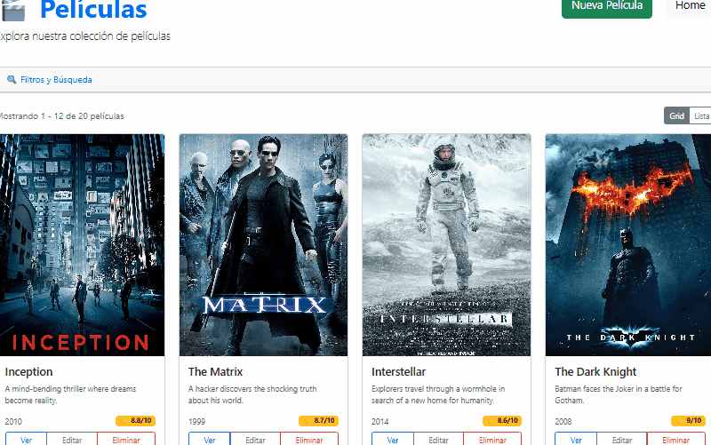

# 🎬 Moviesfy

Aplicación full-stack para gestión de películas construida con el stack **MEAN** (MongoDB, Express, Angular, Node.js).



---

## 📦 Estructura del Proyecto

```Estructura
moviesfy/
├── backend/   # Backend - API REST con Express + MongoDB
├── frontend/  # Frontend - Angular + TypeScript + Bootstrap
├── Animation.gif
└── README.md
```

---

## 🛠 Tecnologías

| Capa       | Tecnología                                      |
| ---------- | ----------------------------------------------- |
| Frontend   | Angular v20, Bootstrap v5, TypeScript, RxJS     |
| Backend    | Node.js, Express.js v5, Mongoose v9             |
| Base datos | MongoDB v8                                      |
| Validación | Zod                                             |
| Seguridad  | Helmet, CORS                                    |
| Logging    | Morgan                                          |

---

## ✨ Características

- CRUD completo de películas
- Paginación y filtrado avanzado (título, año, rating)
- Ordenación ascendente/descendente por múltiples campos
- Vistas grid y lista intercambiables
- Vista previa de imagen al crear/editar
- Modales de confirmación para eliminación
- Validación de formularios en tiempo real
- Desplegada en Orange Pi 5 con systemd + Apache reverse proxy + HTTPS + DDNS

---

## 🚀 Inicio Rápido

### Requisitos

- Node.js 18 o superior
- MongoDB 8
- Angular CLI v20

### Backend

```bash
cd backend
npm install
```

Crea el archivo `.env`:

```env
PORT=3000
MONGODB_URI=mongodb://localhost:27017/movies
```

```bash
npm run dev
```

API disponible en `http://localhost:3000`

### Frontend

```bash
cd frontend
npm install
ng serve
```

App disponible en `http://localhost:4200`

> Si el backend corre en una URL diferente, actualiza `private apiUrl` en `src/app/services/movies.service.ts`.

---

## 📡 API Endpoints

Base URL: `/api/movies`

| Método   | Endpoint | Descripción                 |
| -------- | -------- | -------------------------   |
| `GET`    | `/`      | Obtener todas las películas |
| `GET`    | `/:id`   | Obtener película por ID     |
| `POST`   | `/`      | Crear nueva película        |
| `PUT`    | `/:id`   | Actualizar película         |
| `DELETE` | `/:id`   | Eliminar película           |

### Parámetros de consulta

| Parámetro   | Tipo   | Descripción                                          | Por defecto |
| ----------- | ------ | ---------------------------------------------------- | ----------- |
| `page`      | number | Número de página                                     | 1           |
| `limit`     | number | Resultados por página                                | 10          |
| `sort`      | string | Campo: `title`, `year`, `rating`, `votes`            | `title`     |
| `order`     | string | Dirección: `ASC` o `DESC`                            | `ASC`       |
| `q`         | string | Búsqueda por título                                  | —           |
| `year`      | number | Filtrar por año                                      | —           |
| `minRating` | number | Rating mínimo (0-10)                                 | —           |
| `maxRating` | number | Rating máximo (0-10)                                 | —           |

---

## 🖥 Despliegue (Orange Pi 5)

El backend corre como servicio systemd en `/opt/apps/movies`:

```bash
sudo systemctl status movies.service
sudo systemctl restart movies.service
sudo journalctl -u movies.service -f
```

---

## 👨‍💻 Autor

**deveps** - _Desarrollo Full Stack_

- GitHub: [@devepsdev](https://github.com/devepsdev)
- Portfolio: [deveps.ddns.net](https://deveps.ddns.net)

## 🔗 Enlaces Relacionados

- [Live Demo](https://deveps.ddns.net/movies)

## 📞 Contacto

Enrique — [@devepsdev](https://x.com/devepsdev) — <devepsdev@gmail.com>

---

⭐ ¡Dale una estrella a este proyecto si te ha gustado!

💡 ¿Tienes ideas para mejorar? ¡Abre un issue o contribuye con código!
